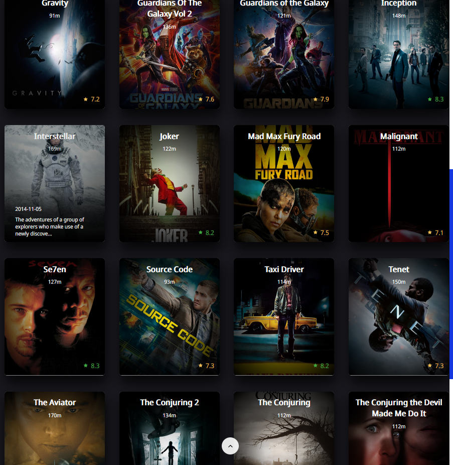
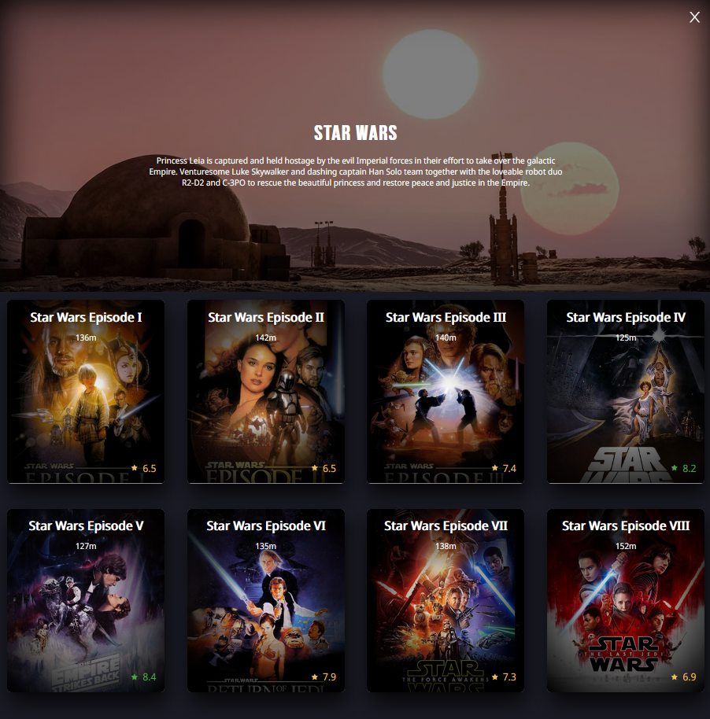
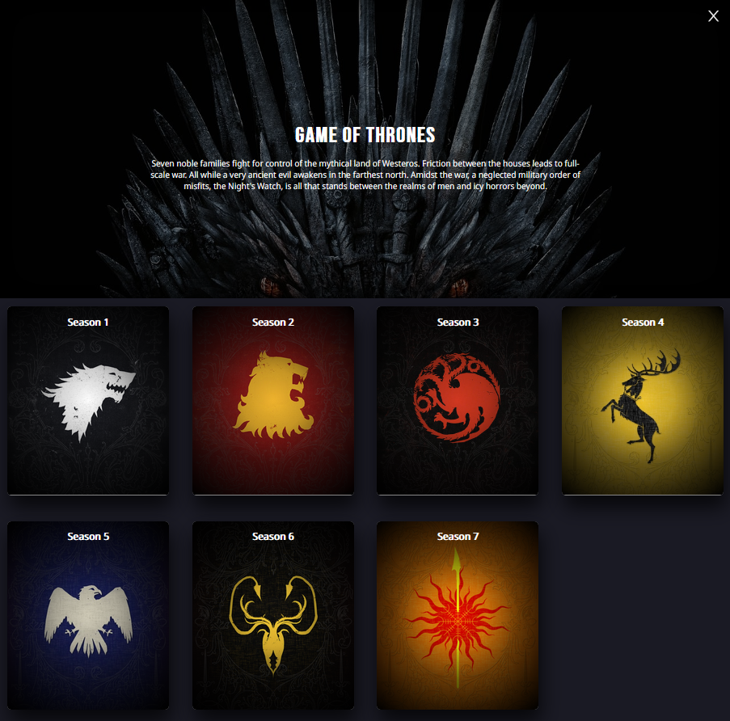
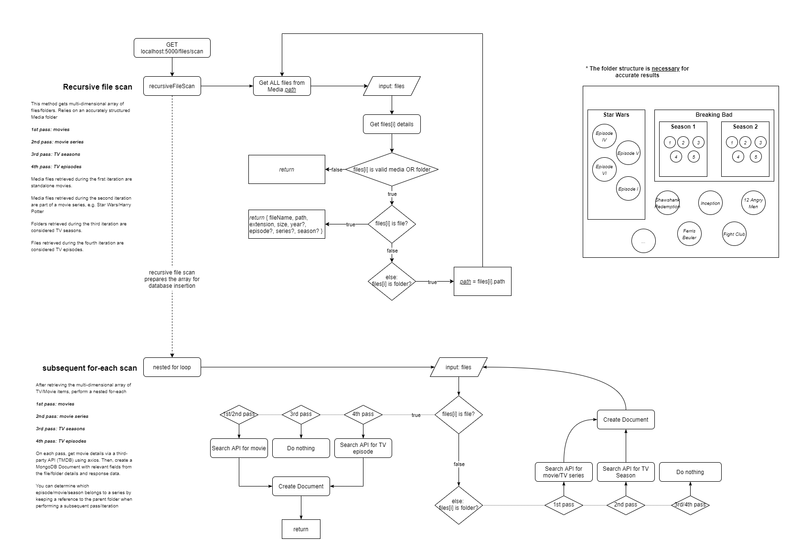
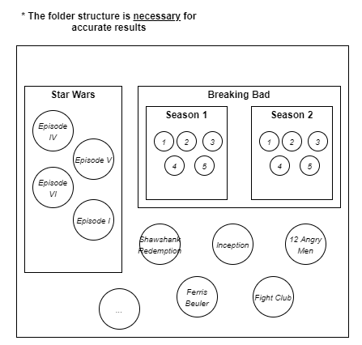

# Local network [streaming app](https://friendly-beaver-7bed97.netlify.app/)

This fullstack web application's purpose is to provide a streaming app to users who have a media collection they want to view in a web application. It should only be hosted on a local network as the distribution of media is illegal.

Relies on [TheMovieDatabase](https://www.themoviedb.org/) to gather details via a movie/tv title.

1. [Demos](#demos)
   - [Live Demo](https://friendly-beaver-7bed97.netlify.app/)
2. [Client](#react-client)
   - [Dependencies](#client-dependencies)
   - [Environment Variables](#client-environment-variables)
3. [Server](#node-server)
   - [Dependencies](#server-dependencies)
   - [Setup](#setup)
   - [Server Environment Variables](#server-environment-variables)
   - [Initialization](#initialization)
   - [API Endpoints](#api-endpoints)
     - [Client Routes](#client-routes)
     - [Admin Routes](#admin-routes)
   - [Comments on Performance](#performance)

## Demos

In the live demo I've used royalty free videos from [Pexels](https://www.pexels.com/videos/)

### [Live Demo](https://friendly-beaver-7bed97.netlify.app/)

#### My Movies



#### Series View



#### TV Series View



#### Demo of the player in desktop view:


#### Demo of the navigation in mobile view:


#### Server initialization process



## React Client

### Client Dependencies

- Build in React
  - Uses a redux store
  - Uses [react-idle-timer](https://www.npmjs.com/package/react-idle-timer)
    - Idle timer used to show movie details/backdrop when the player is in fullscreen. This activates after ~3 seconds.
  - [react-device-detect](https://www.npmjs.com/package/react-device-detect) to detect in code if a user has a mobile/tablet device. This is used for the player functionality as it will act differently between devices.

### Client Environment variables

Since webpack uses dotenv, it's possible to declare environment variables in a `.env` file in the root directory of the client. They must be prefixed with "REACT_APP\_"

- `REACT_APP_BACKEND_URL=https://whispering-reef-63384.herokuapp.com`

## Node Server

Streaming a file via an HTML video element separates the file into chunks and intermittently sends this data through a pipeline.


### Server Depencencies

- express
- mongoose
- [fluent-ffmpeg](https://www.npmjs.com/package/fluent-ffmpeg) - used to get (duration) details about a media file. It is required to use this over the TMDB API as durations may not match, and may cause cuts as the exact duration is required by the streaming functionality
- [parse-torrent-title](https://www.npmjs.com/package/parse-torrent-title) - a handy library which uses regex to parse filenames. RegEx can be added via `parser.addHandler(regex, outputName)`. Parse filenames via `parser.parse(filename)`, which returns an object.
- [axios](https://www.npmjs.com/package/axios) - used to get details of a movie from TMDB

### Setup:

- `npm i` - install npm packages
- `cd dist`
- `node index.js` || `nodemon index.js` - start the server

#### Server Environment Variables

- `DIR=[relative path to your media directory]`
- `MONGO_URI=[mongodb connection string]`
- `ADMIN_PASS=[random string of text]`
  - Used to access admin routes
- `TMDB_API_KEY=[api key]`
- `TMDB_API_URL=https://api.themoviedb.org/3`
- `IMAGE_URL=https://image.tmdb.org/t/p/w1280`

### Initialization:

- **Must have the correct folder structure/naming convention:**
  - 
- If there are existing documents, first drop the collections (always safe to just do this first)
- Hit the /files/scan endpoint and wait a minute or two (depending on how large your media folder is). This will impact the performance of your CPU

### API Endpoints

#### Example responses

Result (movie/episode):

```
[
  {
    _id:          string,
    path:         string,
    duration:     number,
    size:         number,
    extension:    string,
    name:         string,
    displayName:  string,
    description:  string,
    vote_average: number,
    date:         string,
    poster?:      string,
    backdrop?:    string,
    series?:      string,
    season?:      string,
    episode?:     number,
    episodeName?: string
  }
]
```

Result (series):

```
[
  {
    _id:          string,
    path:         string,
    tmdb_id:      number,
    name:         string,
    description:  string,
    vote_average: number,
    date:         string,
    poster?:      string,
    backdrop?:    string
  }
]
```

Result (season):

```
[
  {
    _id:          string,
    path:         string,
    name:         string,
    description:  string,
    date:         string,
    artwork?:     string
  }
]
```

#### Client Routes

**Get movies**

`GET http://localhost:5000/files/media`

**Get series**

`GET http://localhost:5000/files/series`

**Get items from series** - will return media or seasons array along with the variable - `isMedia: [true/false]` indicating whether the response is an array of media or seasons

`GET http://localhost:5000/files/series/[_id]`

**Get items from season**

`GET http://localhost:5000/files/season/[_id]`

### Admin Routes

**Scan the `DIR` directory for all files**

`GET http://localhost:5000/files/scan/[ADMIN_PASS]`

- Accessed via `ADMIN_PASS` environment variable

**Drop all MongoDB collections**

`GET http://localhost:5000/files/drop/[ADMIN_PASS]`

### Performance

During initialization, requests are sent to TMDB's API to retrieve the details of each media. Details are gathered for each series/season (folders), and media item (file). This happens for each media file in your set directory. If you have 300 media files, you will have at least 300 requests performed in the span of a few seconds.
